<div align="center">

# 💳 **Fraudulent Transactions Classification**


Baseline machine‑learning pipeline to detect **fraudulent financial transactions** on a Kaggle dataset.

</div>

---

## 📌 Project Overview
The dataset simulates **30 days of transactions**, where only a **small fraction are fraud**.  
The goal is to build a **simple, explainable** baseline that:
- explores fraud patterns,
- applies sane preprocessing,
- compares classical models,
- and selects a solid starting point for future work.

---

## 📂 Dataset
Kaggle — **Fraudulent Transactions Dataset**  
https://www.kaggle.com/datasets/chitwanmanchanda/fraudulent-transactions-data

Main fields include transaction **type**, **amount**, and account **balances** before/after.  
Class labels: `isFraud` and `isFlaggedFraud`.

---

## 🔄 Pipeline

```mermaid
flowchart LR
  A["Dataset<br/>30 days of transactions"] --> B["EDA<br/>distributions · fraud rate · correlations"]
  B --> C["Preprocessing<br/>encode categoricals · drop collinear · scale"]
  C --> D["Split<br/>train 80% / test 20%"]
  D --> E["Modeling<br/>Naive Bayes · Logistic · Random Forest"]
  E --> F["Evaluation<br/>accuracy"]
  F --> G["Model selection<br/>Random Forest"]

```



---

## 🛠️ What Was Done

### 1) **Exploratory Data Analysis (EDA)**
- Fraud incidence, value distributions, and transaction **type** mix.
- Visualizations: histograms, pie charts, correlation heatmaps.

### 2) **Preprocessing**
- **Categoricals:** encoded `type`, `nameOrig`, `nameDest` (tested both **with** and **without** the high‑cardinality IDs).
- **Collinearity:** dropped `newbalanceDest`, `newbalanceOrig` when redundant/leaky.
- **Class balance:** downsampled/undersampled for quick baselines (see *Future Improvements*).

### 3) **Modeling**
- Compared **Naive Bayes**, **Logistic Regression**, **Random Forest** (with standard scaling where appropriate).
- 80/20 **train–test split**; basic hyperparameters.

---

## 📊 Results (Baseline Summary)
- **Naive Bayes** — weak: poor fit to continuous/imbalanced data.  
- **Logistic Regression** — decent but underfits non‑linear patterns.  
- **Random Forest** — **best baseline accuracy**, especially when *excluding* `nameOrig`/`nameDest` (high cardinality & potential leakage).  

**Chosen baseline:** **Random Forest** with selected features removed.

---

## 🧭 Reproducibility

### Environment
```bash
git clone https://github.com/AnfalAlkuraydis/fraudulent-transactions-detection-ML.git
cd fraudulent-transactions-detection-ML

# optional: create a virtual env
python -m venv .venv
# Windows:
.venv\Scripts\activate
# macOS/Linux:
source .venv/bin/activate

pip install -r requirements.txt  # or: pip install numpy pandas scikit-learn matplotlib seaborn
```

---

## 🔮 Future Improvements
1. **Imbalanced Learning:** SMOTE / SMOTE‑Tomek, **class weights**, focal loss (for trees: `class_weight='balanced'`).  
2. **Feature Engineering:** time‑of‑day, rolling stats per account, velocity features.  
3. **Modeling:** hyperparameter search; try **XGBoost/LightGBM/CatBoost**.  
4. **Evaluation:** report **PR‑AUC**, calibration curves, and business‑aligned **cost metrics**.  
5. **Deployment:** pickle the model & build a small **FastAPI** service for real‑time scoring.  
6. **Explainability:** permutation importance, SHAP for top features.

---

<div align="center">
Made with ❤️ — a clean baseline that’s ready to grow into a production fraud detector.
</div>
